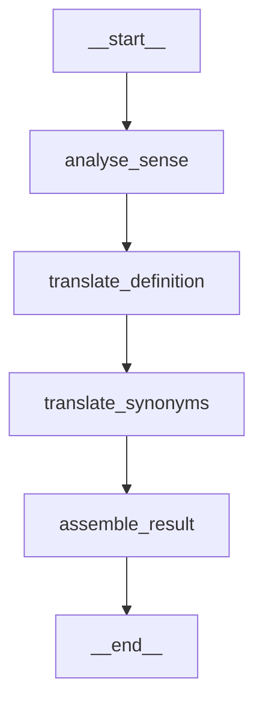

# Graph Visualization Implementation Summary

## ✅ What Was Created

### 1. **Main Visualization Script** (`visualize_translation_graph.py`)
A comprehensive Python script that:
- ✅ Extracts graph structure from the LangGraph pipeline
- ✅ Generates Mermaid diagrams (text-based, for GitHub/docs)
- ✅ Creates PNG images (requires graphviz)
- ✅ Produces ASCII art diagrams (terminal-friendly)
- ✅ Generates detailed markdown documentation
- ✅ **Auto-updates whenever graph structure changes**

### 2. **Generated Visualizations**

#### 📊 `translation_graph.mmd` - Mermaid Diagram

- Can be viewed on [mermaid.live](https://mermaid.live)
- Renders automatically in GitHub markdown
- Copy-paste ready for documentation

#### 🖼️ `translation_graph.png` - PNG Image
- Visual representation of the graph
- Perfect for presentations and documentation
- Generated using LangGraph's native visualization

#### 📝 `translation_graph.txt` - ASCII Diagram
```
    ┌─────────┐
    │  START  │
    └────┬────┘
         │
         ▼
    ┌─────────────────────┐
    │  analyse_sense      │  ← Stage 1
    │  📊 Sense Analysis  │
    └──────────┬──────────┘
         ...
```
- Terminal-friendly
- No graphics dependencies needed

#### 📚 `translation_graph_doc.md` - Full Documentation
Comprehensive documentation including:
- Embedded Mermaid diagram
- Detailed explanation of each stage
- State flow description
- Design rationale and extensibility guide

### 3. **Documentation**

#### `GRAPH_VISUALIZATION_README.md`
Guide explaining:
- How to view visualizations
- How to regenerate them
- Integration options
- Best practices

## 🎯 Key Features

### ✅ Automatic Updates
The script reads the actual graph structure from code, so:
- **No manual diagram maintenance**
- **Always in sync with code**
- **One command to update everything**

### ✅ Multiple Formats
Different formats for different use cases:
- **Mermaid**: For GitHub/GitLab/docs
- **PNG**: For presentations/slides
- **ASCII**: For terminals/text-only
- **Markdown**: For comprehensive docs

### ✅ Rich Documentation
Automatically generates:
- Stage descriptions
- Input/output specifications
- Design rationale
- Extensibility guidelines

### ✅ Easy to Use
```bash
# Basic usage
python visualize_translation_graph.py

# Custom output location
python visualize_translation_graph.py --output-dir ./docs/images
```

## 📊 Graph Structure Captured

The visualization shows the **4-stage sequential pipeline**:

1. **analyse_sense** (📊)
   - Analyzes word sense and semantic features
   - Builds understanding before translation

2. **translate_definition** (📝)
   - Translates definition using sense context
   - Maintains semantic precision

3. **translate_synonyms** (🔤)
   - Generates synonym candidates
   - Assigns confidence levels

4. **assemble_result** (📦)
   - Combines all outputs
   - Creates final result and curator summary

## 💡 Benefits

### For Development
- ✅ Visual understanding of pipeline flow
- ✅ Easy to spot structural issues
- ✅ Quick reference during coding
- ✅ Helps onboard new developers

### For Documentation
- ✅ Professional diagrams without manual drawing
- ✅ Always accurate and up-to-date
- ✅ Multiple formats for different contexts
- ✅ Embedded in markdown docs

### For Collaboration
- ✅ Share visual architecture easily
- ✅ Explain complex flows clearly
- ✅ Document design decisions
- ✅ Support code reviews with visuals

## 🔄 Workflow Integration

### During Development
```bash
# After modifying graph structure
python visualize_translation_graph.py

# Commit the updated visualizations
git add translation_graph.*
git commit -m "Update graph visualizations"
```

### In CI/CD
```yaml
# .github/workflows/docs.yml
- name: Generate graph visualizations
  run: |
    python visualize_translation_graph.py --output-dir ./docs
    git add docs/translation_graph.*
```

### Pre-commit Hook
```bash
# .git/hooks/pre-commit
#!/bin/bash
if git diff --cached --name-only | grep -q "langgraph_translation_pipeline.py"; then
    echo "Graph structure changed, regenerating visualizations..."
    python visualize_translation_graph.py
    git add translation_graph.*
fi
```

## 📂 File Organization

```
wordnet_autotranslate/
├── visualize_translation_graph.py     # Main script (executable)
├── translation_graph.mmd              # Mermaid source
├── translation_graph.png              # PNG image
├── translation_graph.txt              # ASCII diagram
├── translation_graph_doc.md           # Full documentation
├── GRAPH_VISUALIZATION_README.md      # Usage guide
└── src/wordnet_autotranslate/
    └── pipelines/
        └── langgraph_translation_pipeline.py  # Source of truth
```

## 🎨 Customization Options

The script can be extended to:
- Add custom styling to Mermaid diagrams
- Generate additional formats (SVG, PDF)
- Include performance metrics in diagrams
- Show conditional branches if added
- Highlight critical paths
- Add stage timing information

## ✨ Summary

**Created:**
- ✅ Visualization script with 4 output formats
- ✅ Auto-generated diagrams (Mermaid, PNG, ASCII, Markdown)
- ✅ Comprehensive documentation
- ✅ Usage guide

**Key Achievement:**
**One command updates all visualizations automatically!**

```bash
python visualize_translation_graph.py
```

**Impact:**
- Diagrams always match code structure
- No manual diagram maintenance
- Better documentation quality
- Easier collaboration and onboarding

---

**Next Steps:**
1. Run `python visualize_translation_graph.py` after any graph changes
2. Include diagrams in main README.md
3. Add to CI/CD pipeline for automatic updates
4. Share PNG in presentations and docs
