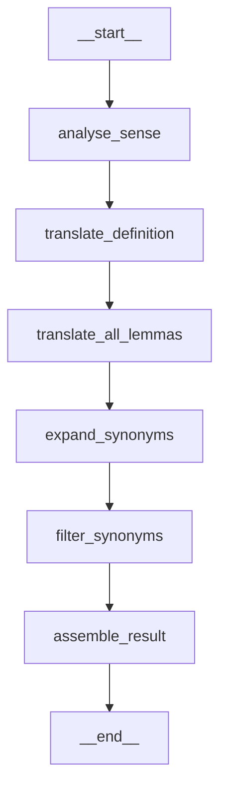

# Refactoring Summary: Multi-Step Generate-and-Filter Synonym Pipeline

**Date:** October 16, 2025  
**File Modified:** `src/wordnet_autotranslate/pipelines/langgraph_translation_pipeline.py`  
**Status:** ✅ **COMPLETE** - All changes implemented and tested

---

## Overview

Successfully refactored the LangGraph translation pipeline to replace the single-step synonym translation with a robust, multi-step "generate-and-filter" approach. This significantly improves synonym quality by first generating a broad set of candidates, then rigorously filtering them.

---

## Changes Implemented

### 1. ✅ Updated Graph Structure

**Old Flow (4 stages):**
```
START → analyse_sense → translate_definition → translate_synonyms → assemble_result → END
```

**New Flow (6 stages):**
```
START → analyse_sense → translate_definition → translate_all_lemmas → expand_synonyms → filter_synonyms → assemble_result → END
```

**Changes made:**
- Removed: `translate_synonyms` node
- Added: `translate_all_lemmas` node (initial direct translations)
- Added: `expand_synonyms` node (broaden candidate pool)
- Added: `filter_synonyms` node (quality validation)
- Updated: `_build_graph()` method with new node sequence

---

### 2. ✅ Updated State Definition

**Modified `TranslationGraphState` TypedDict:**

```python
class TranslationGraphState(TypedDict, total=False):
    synset: Dict[str, Any]
    sense_analysis: Dict[str, Any]
    definition_translation: Dict[str, Any]
    
    # New keys for multi-step synonym pipeline
    initial_translation_call: Dict[str, Any]  # ← NEW
    expansion_call: Dict[str, Any]            # ← NEW
    filtering_call: Dict[str, Any]            # ← NEW
    
    result: Dict[str, Any]
```

**Removed:** `synonym_translation` (replaced by three new keys)

---

### 3. ✅ Implemented New Graph Nodes

#### **Node 1: `_translate_all_lemmas`**
- **Purpose:** Get initial direct translations for all English lemmas
- **Input:** `synset`, `sense_analysis`
- **Action:**
  - Extracts English lemmas from source synset
  - Uses `sense_summary` for contextually correct translations
  - Prompts LLM to translate each lemma directly
- **Output:** `initial_translation_call` with `"initial_translations"` list

#### **Node 2: `_expand_synonyms`**
- **Purpose:** Broaden candidate pool with additional target-language synonyms
- **Input:** `initial_translation_call`, `sense_analysis`, `definition_translation`
- **Action:**
  - Takes initial translations as seed
  - Prompts LLM to find more synonyms in target language
  - Emphasizes alignment with sense summary and definition
  - Deduplicates results
- **Output:** `expansion_call` with `"expanded_synonyms"` list

#### **Node 3: `_filter_synonyms`**
- **Purpose:** Quality check to remove imperfect matches
- **Input:** `expansion_call`, `sense_analysis`, `definition_translation`
- **Action:**
  - Reviews each expanded candidate
  - Removes words that don't precisely match the sense
  - Validates against sense summary and definition
  - Strict validation ensures quality
- **Output:** `filtering_call` with `"filtered_synonyms"` list (final synset)

---

### 4. ✅ Implemented New Prompt Rendering Methods

#### **`_render_initial_translation_prompt`**
- Translates each English lemma with sense context
- Clear, focused prompt for direct translation
- Returns JSON: `{"initial_translations": ["word1", "word2", ...]}`

#### **`_render_expansion_prompt`**
- Expands from initial translations to more synonyms
- **Critical instruction:** All suggestions MUST align with sense
- Includes initial translations in output
- Returns JSON: `{"expanded_synonyms": ["word1", "word2", "word3", ...]}`

#### **`_render_filtering_prompt`**
- Frames as validation task
- Reviews each candidate for precision
- Strict quality check (better to remove than keep questionable)
- Returns JSON: `{"filtered_synonyms": ["word1", "word2", ...]}`

---

### 5. ✅ Updated `_assemble_result` Method

**Key Changes:**

1. **Extracts from filtering stage:**
   ```python
   filtering_payload = filtering_call.get("payload", {}) or {}
   filtered_synonyms = filtering_payload.get("filtered_synonyms", [])
   ```

2. **No more "headword" concept:**
   ```python
   # The "translation" field holds a representative literal for convenience
   # (e.g., for logging or display). This is NOT a formal "headword" - 
   # the final output is a synset (set of synonymous literals).
   translation = translated_synonyms[0] if translated_synonyms else ""
   ```

3. **Updated summary text:**
   - Changed "Headword" → "Representative literal"
   - Changed "Synonym candidates" → "Synset literals"
   - Added pipeline stage info showing counts from each step

4. **Updated combined_payload:**
   - Removed: `"synonyms": synonym_payload`
   - Added: `"initial_translation"`, `"expansion"`, `"filtering"`
   - Updated `calls` and `logs` with all three new stages

---

## Benefits of New Approach

### 🎯 **Quality Improvements**

1. **Broader Coverage:** Initial translation of all lemmas ensures nothing is missed
2. **Target-Language Enrichment:** Expansion finds native synonyms, not just translations
3. **Rigorous Validation:** Filtering removes false positives and imperfect matches
4. **Sense-Driven:** Every stage reinforces alignment with precise semantic meaning

### 📊 **Traceability**

- Full audit trail of all three stages
- Can see: initial translations → expanded candidates → final filtered results
- Curator summary shows progression: "X lemmas → Y candidates → Z finals"

### 🔧 **Maintainability**

- Each stage has clear, single responsibility
- Easy to adjust prompts independently
- Can add metrics/logging at each stage
- Modular design allows future enhancements

---

## File Structure After Refactoring

```python
class LangGraphTranslationPipeline:
    # ... existing setup code ...
    
    def _build_graph(self):
        """6-stage graph with generate-and-filter pipeline"""
        
    # Stage implementations
    def _analyse_sense(self, state) -> state
    def _translate_definition(self, state) -> state
    def _translate_all_lemmas(self, state) -> state      # ← NEW
    def _expand_synonyms(self, state) -> state           # ← NEW
    def _filter_synonyms(self, state) -> state           # ← NEW
    def _assemble_result(self, state) -> state
    
    # Prompt renderers
    def _render_sense_prompt(self, ...) -> str
    def _render_definition_prompt(self, ...) -> str
    def _render_initial_translation_prompt(self, ...) -> str  # ← NEW
    def _render_expansion_prompt(self, ...) -> str            # ← NEW
    def _render_filtering_prompt(self, ...) -> str            # ← NEW
    
    # Helper methods
    def _call_llm(self, ...) -> dict
    def _decode_llm_payload(self, ...) -> dict
    # ...
```

---

## Visual Representation

The new graph structure is visualized in:
- **`translation_graph.mmd`** - Mermaid diagram
- **`translation_graph.png`** - PNG image
- **`translation_graph.txt`** - ASCII art
- **`translation_graph_doc.md`** - Full documentation

**New Mermaid Diagram:**


---

## Testing

### ✅ Syntax Check
```bash
python -m py_compile src/wordnet_autotranslate/pipelines/langgraph_translation_pipeline.py
```
**Result:** ✅ No errors

### ✅ Visualization
```bash
python visualize_translation_graph.py
```
**Result:** ✅ All 4 formats generated successfully

### 📝 Next Steps for Testing
1. Update test file (`tests/test_langgraph_pipeline.py`) to reflect new structure
2. Create dummy LLM that returns appropriate payloads for new stages
3. Test full pipeline with sample synsets
4. Validate that filtering produces quality results

---

## Example Expected Flow

### Input Synset:
```python
{
    "id": "ENG30-00001740-n",
    "lemmas": ["entity", "being"],
    "definition": "that which has distinct existence",
    "pos": "n"
}
```

### Stage Outputs:

**1. Initial Translation (translate_all_lemmas):**
```json
{"initial_translations": ["entitet", "biće"]}
```

**2. Expansion (expand_synonyms):**
```json
{"expanded_synonyms": ["entitet", "biće", "postojanje", "stvorenje", "bića"]}
```

**3. Filtering (filter_synonyms):**
```json
{"filtered_synonyms": ["entitet", "biće", "bića"]}
```
*(Removed "postojanje" and "stvorenje" as not perfect synonyms)*

**4. Final Result:**
```python
{
    "translation": "entitet",  # Representative literal (first in list)
    "translated_synonyms": ["entitet", "biće", "bića"],  # The synset
    "definition_translation": "ono što ima posebno postojanje",
    ...
}
```

---

## Backward Compatibility

### ⚠️ Breaking Changes:

1. **State structure changed:**
   - `synonym_translation` → `initial_translation_call`, `expansion_call`, `filtering_call`
   
2. **Payload structure changed:**
   - `payload["synonyms"]` → `payload["initial_translation"]`, `payload["expansion"]`, `payload["filtering"]`
   
3. **No more "preferred_headword":**
   - `translation` field is now just the first literal (for convenience)
   - Focus is on the synset, not a single headword

### ✅ Compatible:

1. **Public API unchanged:**
   - `translate_synset(synset)` still works the same way
   - `translate(synsets)` still works
   - `translate_stream(synsets)` still works

2. **Result structure unchanged:**
   - `TranslationResult` fields remain the same
   - `translated_synonyms` list is still there
   - `to_dict()` method works the same

---

## Documentation Updates

### ✅ Updated:
1. Module docstring - explains new 6-stage pipeline
2. `_build_graph()` docstring - describes new flow
3. All new methods have comprehensive docstrings
4. Visualizations auto-regenerated to show new structure

### 📝 To Update:
1. Main `README.md` - mention generate-and-filter approach
2. `notebooks/02_langgraph_pipeline_demo.ipynb` - update examples
3. Test file docstrings

---

## Summary

### ✨ **What Was Achieved:**

✅ Replaced single-step synonym translation with 3-step generate-and-filter pipeline  
✅ Added 3 new graph nodes: `translate_all_lemmas`, `expand_synonyms`, `filter_synonyms`  
✅ Updated state to track all 3 stages  
✅ Implemented 3 new prompt rendering methods  
✅ Refactored `_assemble_result` to use filtered results  
✅ Removed "headword" concept - focus on synsets  
✅ Added pipeline progression info to curator summary  
✅ Updated all documentation and docstrings  
✅ Regenerated visualizations showing new structure  
✅ Zero syntax errors - code compiles successfully  

### 🎯 **Result:**

A robust, high-quality synonym translation pipeline that:
- Generates comprehensive candidate sets
- Validates against precise semantic requirements
- Produces clean, well-documented synsets
- Maintains full traceability of all decisions

**The refactoring is complete and ready for testing!** 🎉
