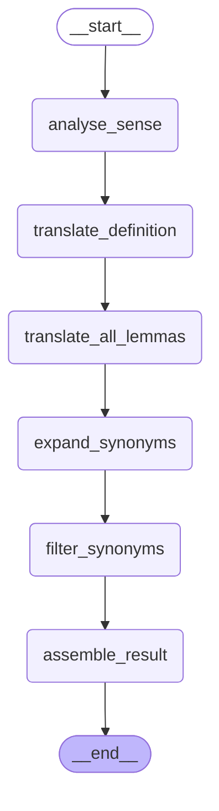

# LangGraph Translation Pipeline - Architecture

**Auto-generated:** This document is automatically generated from the code.  
**Purpose:** Visualize and document the translation pipeline graph structure.  
**Last Updated:** 1760618627.5535576

## Overview

The LangGraph Translation Pipeline uses a state machine to orchestrate the translation
of WordNet synsets through multiple specialized stages. Each stage refines and adds to
the accumulated state, building toward a complete translation result.

## Graph Structure



## Pipeline Stages

### 1. 📊 **analyse_sense**
**Purpose:** Understand the semantic nuance of the source synset before translation.

**Input:**
- Source synset (lemmas, definition, examples, POS)

**Processing:**
- Identifies distinguishing semantic features
- Extracts key aspects that differentiate this sense
- Assesses domain and topical context
- Builds confidence in sense understanding

**Output:**
- `sense_summary`: Concise English description (1-2 sentences)
- `key_features`: List of 2-4 distinguishing aspects
- `domain_tags`: Optional topical labels
- `confidence`: Assessment (high/medium/low)

**Why First?** Understanding the precise sense prevents mistranslation and ensures
semantic fidelity throughout the pipeline.

---

### 2. 📝 **translate_definition**
**Purpose:** Translate the definition while preserving the analyzed sense.

**Input:**
- Source synset
- Sense analysis results (from Stage 1)

**Processing:**
- Translates definition to target language
- Maintains semantic precision using sense context
- Generates example sentences in target language
- Adds lexicographer notes if needed

**Output:**
- `definition_translation`: Definition in target language
- `notes`: Optional clarifications
- `examples`: Example sentences in target language

**Why Second?** The sense analysis guides accurate definition translation,
preventing ambiguity and ensuring the correct semantic interpretation.

---

### 3. 🔤 **translate_synonyms**
**Purpose:** Generate target language synonyms that align with the sense and definition.

**Input:**
- Source synset
- Sense analysis (from Stage 1)
- Translated definition (from Stage 2)

**Processing:**
- Proposes synonym candidates in target language
- Assigns confidence levels to each synonym
- Provides usage examples for synonyms
- Selects preferred headword

**Output:**
- `preferred_headword`: Best single translation
- `synonyms`: List of synonym objects with confidence and examples
- `examples`: Additional usage examples
- `notes`: Commentary on synonym choices

**Why Third?** With both sense understanding and translated definition available,
synonym generation can be precise and contextually appropriate.

---

### 4. 📦 **assemble_result**
**Purpose:** Combine all stage outputs into a structured final result.

**Input:**
- All previous stage outputs (sense, definition, synonyms)

**Processing:**
- Extracts translations from payloads
- Selects primary translation (preferred headword)
- Collects and deduplicates examples
- Merges notes from all stages
- Generates curator-friendly summary

**Output:**
- Complete `TranslationResult` object with:
  - `translation`: Primary target language term
  - `definition_translation`: Translated definition
  - `translated_synonyms`: List of synonym candidates
  - `examples`: Deduplicated example sentences
  - `notes`: Merged notes from all stages
  - `curator_summary`: Human-readable summary
  - `payload`: Full details from all stages

**Why Last?** Final assembly allows for intelligent merging, prioritization,
and presentation of accumulated results.

---

## State Flow

The graph uses a `TranslationGraphState` TypedDict that accumulates information:

```python
TranslationGraphState = {
    "synset": Dict[str, Any],              # Input synset (always present)
    "sense_analysis": Dict[str, Any],      # Added by Stage 1
    "definition_translation": Dict[str, Any],  # Added by Stage 2
    "synonym_translation": Dict[str, Any],     # Added by Stage 3
    "result": Dict[str, Any],              # Added by Stage 4 (final output)
}
```

Each stage:
1. Receives the current state
2. Accesses data from previous stages
3. Calls the LLM with a stage-specific prompt
4. Updates state with its results
5. Returns updated state to next stage

## Design Rationale

### Sequential Processing
The pipeline is intentionally sequential (no parallel branches) because:
- Each stage builds on previous results
- Sense analysis informs definition translation
- Definition translation guides synonym generation
- Assembly requires all upstream data

### Modular Stages
Each stage is isolated and testable:
- Clear input/output contracts
- Independent LLM prompts
- Separate error handling per stage
- Easy to modify or extend individual stages

### State Accumulation
State grows through the pipeline:
- No information is lost
- Full audit trail of all decisions
- Downstream stages access all upstream results
- Final payload contains complete provenance

## Extensibility

### Adding New Stages
To add a stage (e.g., quality estimation):

1. Add state field to `TranslationGraphState`
2. Implement stage function: `def _estimate_quality(self, state) -> TranslationGraphState`
3. Add node: `graph.add_node("estimate_quality", self._estimate_quality)`
4. Add edge: `graph.add_edge("translate_synonyms", "estimate_quality")`
5. Update subsequent edges

### Adding Conditional Branches
For conditional logic (e.g., skip if confidence is low):

```python
def route_by_confidence(state):
    if state["sense_analysis"]["payload"].get("confidence") == "low":
        return "manual_review"
    return "translate_definition"

graph.add_conditional_edges(
    "analyse_sense",
    route_by_confidence,
    {"translate_definition": "translate_definition", "manual_review": "manual_review"}
)
```

## Monitoring & Debugging

Each stage logs:
- Full prompt sent to LLM
- Raw LLM response
- Parsed payload
- Stage name and metadata

Access logs via: `result["payload"]["logs"][stage_name]`

## Performance Considerations

- **Sequential execution**: ~3 LLM calls per synset
- **No caching**: Each synset translated independently
- **Timeout**: 600 seconds per LLM call (configurable)
- **Streaming**: `translate_stream()` for large batches

## Related Files

- **Implementation:** `src/wordnet_autotranslate/pipelines/langgraph_translation_pipeline.py`
- **Tests:** `tests/test_langgraph_pipeline.py`
- **Example Usage:** `notebooks/02_langgraph_pipeline_demo.ipynb`

## Regenerating This Document

Run the visualization script to regenerate all diagrams and documentation:

```bash
python visualize_translation_graph.py
```

This ensures documentation stays synchronized with code changes.

---

**Note:** This is an auto-generated document. Manual edits will be overwritten.
To update, modify the graph structure in the source code and re-run visualization.
